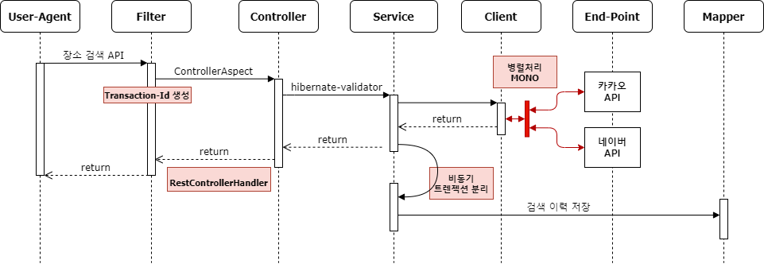
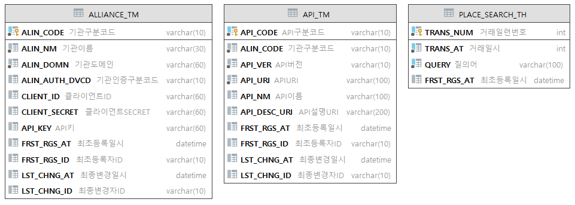
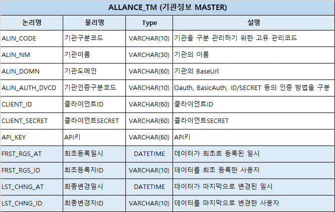
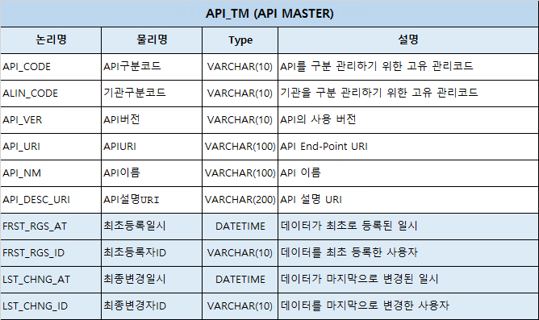
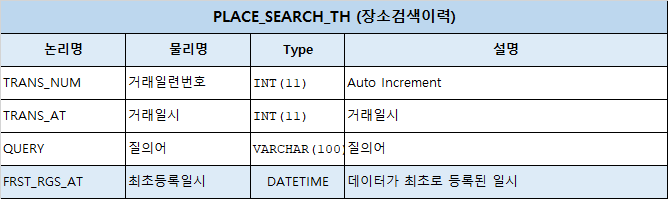

# 장소검색 API 서비스
> 안녕하세요. 카카오뱅크 코딩테스트를 위한 프로젝트 입니다. :heart_eyes:  
> 구현 상의 필수 요구사항을 모두 충족하여 개발하였습니다.  
> 감사합니다.

## Table of Contents 
- [개발환경](#개발환경)
- [기술요소](#기술요소)
- [테스트 환경](#테스트-환경)
- [핵심 문제해결 전략](#핵심-문제해결-전략)
- [API 명세서](#API-명세서)
- [DataBase 설계](#DataBase-설계)

## 개발환경
* Framework : spring-boot 2.3.9.RELEASE
* Language : JDK 1.8.0_291
* Build : Gradle-7.1.1
* WAS : Embeded Tomcat
* DBMS : h2Database 1.4.200 서버모드(TCP)
* IDE : Intellij IDEA
* Test : Swagger 3.0

## 오픈소스
* DBMS : H2Database 1.4.200 서버모드(TCP)
  * 목적 : API정보, 기관정보, 검색이력을 설계 및 표준 SQL을 사용하기 위함.
  * 참조 : [H2ServerConfig.java](./src/main/java/com/pilsa/place/framework/database/H2ServerConfig.java)
* ORM : Mybatis 2.1.4
  * 목적 : Query 작성 및 H2DB와 연계 사용하여 설계된 DataBase를 핸들링 하기 위함.
  * 참조 : [mybatis-config.xml](./src/main/resources/mybatis/mybatis-config.xml)
* Cache : ehcache 3.7.0
  * 목적 : DBMS의 부하를 줄이고 대용량 트래픽을 고려하여 서비스 특징에 맞게 사용함.
  * 참조 : [EhcacheConfig.java](./src/main/java/com/pilsa/place/framework/ehcache/EhcacheConfig.java)
* spring-boot-starter-webflux 2.3.9 (webclient)
  * 목적 : 카카오와 네이버의 서로다른 End-Point API를 동시/병렬로 요청하여 처리속도 향상을 위함. 
  * 참조 : [ClientService.java](./src/main/java/com/pilsa/place/biz/client/service/ClientService.java)
* hibernate-validator 6.1.7
  * 목적 : 데이터 유효성 검증에 대한 로직의 중복을 줄이고, 비지니스 로직과 분리하기 위함. 
  * 참조 : [PlaceRequest.java](src/main/java/com/pilsa/place/biz/vo/request/PlaceRequest.java)
* lombok 1.18.18
  * 목적 : 생산성 향상 및 가독성 및 유지보수 향상을 위하여 사용함.
  * 참조 : Request, Response, VO, DTO 등에서 전부 사용함.


## 테스트 환경  
> Local-WAS 부트 업 이후에 아래 2가지 방법으로 테스트가 가능합니다.  
> 테스트를 위하여 Swagger 설정을 하였습니다. 한번 봐주세요.:heart_eyes:
* Swagger 테스트
  * [장소검색 API 서비스 swagger](http://localhost:8087/swagger-ui/#/place) 
  * http://localhost:8087/swagger-ui/#/place
* HTTP Request file 테스트
  * [placeSearch-api-test.http](placeSearch-api-test.http)

## 핵심 문제해결 전략

* 대용량 트래픽
  * 카카오와 네이버의 다른 End-Point를 WebClient Mono Zip을 이용하여 병렬 호출한 후 응답을 통합하여 반환합니다.
  * 검색한 이력을 비동기, 신규 트렉젝션으로 저장하여 빠르고 안전하게 API를 응답합니다. (부모의 transactionId는 유지)
  * 장소검색이력 테이블에 시간정보 컬럼에 Index 생성과 int tpye 설계로 빠른 조회가 가능합니다.
  * 인기 키워드 API 조회 시 5초(timeToLive) 동안 유효한 Cache에 저장되어 DB부하를 줄입니다.
  
* 서비스 확장성, 장애 대응
  * 기관정보, API정보 DB를 설계하여 Cache에 저장 하도록 처리하였습니다.  
    신규 API 개발시 Client 프로그램을 추가로 개발할 필요가 없습니다. [HttpClient.java](src/main/java/com/pilsa/place/framework/webclient/HttpClient.java), [ApiCodeService.java](src/main/java/com/pilsa/place/common/code/service/ApiCodeService.java)
  * Controller AOP를  [ControllerAspect.java](src/main/java/com/pilsa/place/framework/aspect/ControllerAspect.java)적용하여 공통 로직을 처리합니다. 
  * 다수의 인스턴스 환경에서도 유니크한 transactionId를 [FilterConfig.java](src/main/java/com/pilsa/place/framework/servlet/filter/FilterConfig.java) 에서 채번 하였습니다.  
    API 장애 시 거래에 대한 추적을 위하여 Slf4j-MDC를 활용, API 응답 Header값에 함께 반환합니다.


## API 명세서
### 1. 장소 검색 API
> URI : http://localhost:8087/v1/place  
> HTTP Method : GET  
> 설명 : `query` 파라미터를 필수로 요청 받습니다.   
> 카카오와 네이버의 검색 API에서 동일한 `query`로 각각 5개의 `size`로 요청합니다.  
> 응답받은 결과 중 카카오 결과 네이버 결과 모두 존재하는 `place`의 경우 최상위에 정렬합니다.  
> 둘 중 하나만 존재하는 경우 카카오 결과를 우선 정렬 후 네이버 결과를 정렬합니다.  
> 요청받은 `query`는 `장소검색이력 테이블`에 저장합니다. 단 검색 결과가 0건인 경우 저장하지 않습니다.   
> 키워드 저장 시 장소 검색 `Transaction` 과 분리하여 `Async` 호출합니다.

#### Request Example
```http request
curl --location --request GET 'http://localhost:8087/v1/place?query=휘경 어린이집'
```

#### response Example
```json
{
    "meta": {
        "totalCount": 8
    },
    "places": [
        {
            "placeName": "동화어린이집",
            "addressName": "서울 동대문구 휘경동 282-6",
            "roadAddressName": "서울 동대문구 망우로12가길 20",
            "placeUrl": "http://place.map.kakao.com/12144504"
        },
        {
            "placeName": "휘경스마일어린이집",
            "addressName": "서울 동대문구 휘경동 183-381",
            "roadAddressName": "서울 동대문구 이문로8길 8-7",
            "placeUrl": "http://place.map.kakao.com/27368002"
        }
      ...중략...
    ]
}
```


### 2. 인기키워드 API
> URI : http://localhost:8087/v1/place/keywords  
> HTTP Method : GET  
> 설명 : `키워드`는 분포 및 빈도수 계산을 위하여 `장소검색이력 테이블`에 `시간`정보와 함께 저장됩니다.  
> 기본은 24시간 범위 안에 검색한 인기 키워드의 순위가 최대 10개까지 제공됩니다.  
> 범위 검색의 조건으로 사용하는 `TRANS_AT(거래일시)` 컬럼에 `INDEX`를 설정 하였고,  
> `int` type 으로 설계되었습니다. `UNIX_TIMESTAMP`를 사용하여 빠른 조회가 가능합니다.  
> 또한 조회된 인기 키워드 결과는 Cache에 저장되며 `5초`(timeToLive) 동안만 유효합니다.   


#### Request Example
```http request
curl --location --request GET 'http://localhost:8087/v1/place/keywords'
```
#### response Example
```json
{
  "meta": {
    "totalCount": 10
  },
  "keywords": [
    {
      "query": "서울시청",
      "rank": 1,
      "queryCnt": 18
    },
    {
      "query": "휘경 유치원",
      "rank": 2,
      "queryCnt": 12
    }
    ...중략...
}
```

### 3. 에러 응답

> 모든 에러 응답은 `errorType`과 `errorMessages`를 포함하고 있습니다.  
> HTTP 상태코드가 `4XX`대의 에러인 경우 조치 방법을 `message`에 안내합니다.
#### Error response Example
```json
{
    "errorType": "MissingRequiredParameters",
    "errorMessages": "['query 는 길이가 1에서 100 사이여야 합니다.']"
}
```

## DataBase 설계
> h2Database 서버 모드로 구성하여 Local WAS 부트업 이후 ``TCP`` 접속이 가능합니다.   
> 아래는 접속 정보 입니다.  
* h2Database WebConsole : http://localhost:8087/h2
* JDBC URL : `jdbc:h2:tcp://localhost:9095/./data/investdb;MODE=MySQL`
* UserName: `pilsa115`
* password : `pilsa115`   



#### :floppy_disk: 기관정보 테이블 (ALLIANCE_TM) 설계


#### :floppy_disk: API정보 테이블 (API_TM) 설계


#### :floppy_disk: 장소검색이력 테이블 (PLACE_SEARCH_TH) 설계

