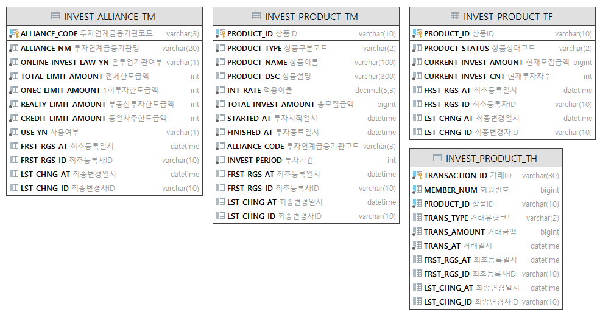
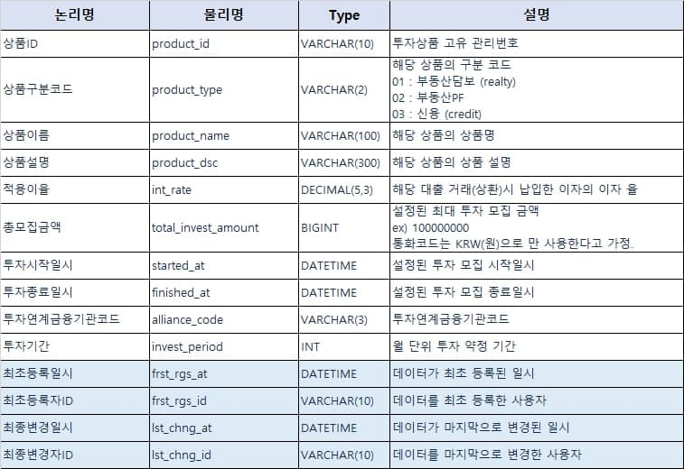
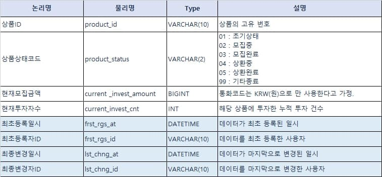
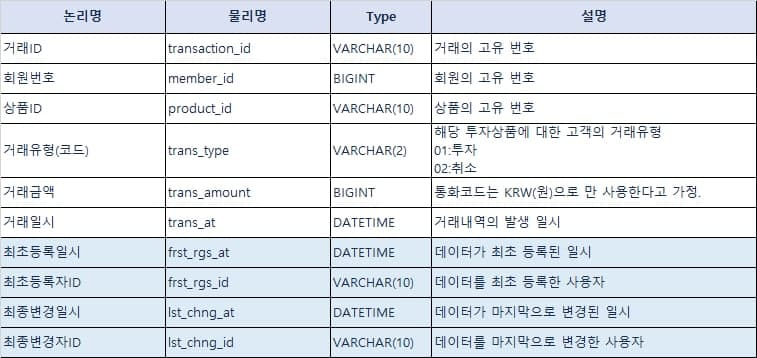
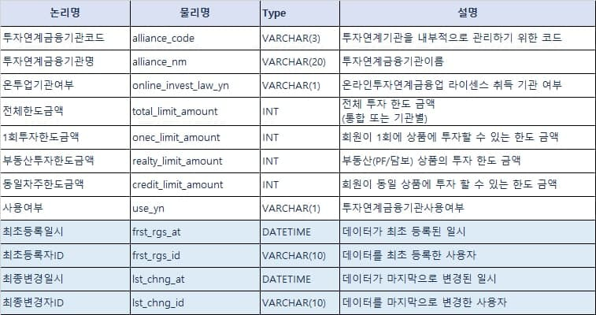

# 장소검색 API 서비스
> 안녕하세요. :heart_eyes: 카카오뱅크 코딩테스트를 위한 프로젝트 입니다.  
> 구현 상의 필수 요구사항을 모두 충족하여 개발하였습니다.  
> 감사합니다.

## Table of Contents 
- [개발환경](#개발환경)
- [기술요소](#기술요소)
- [테스트 환경](#테스트-환경)
- [응답코드 및 응답메시지](#응답코드-및-응답메시지)
- [DataBase 설계](#DataBase-설계)
- [API 명세서](#API-명세서)

## 개발환경
* Framework : spring-boot 2.3.9.RELEASE
* Language : JDK 1.8.0_291
* Build : Gradle-7.1.1
* WAS : Embeded Tomcat
* DBMS : h2Database 1.4.200 서버모드(TCP)
* IDE : Intellij IDEA
* Test : Swagger 3.0

## 오픈소스
* DBMS : H2Database 1.4.200 서버모드(TCP)
  * 목적 : API정보, 기관정보, 검색이력을 설계 및 표준 SQL을 사용하기 위함.
  * 참조 : [H2ServerConfig.java](./src/main/java/com/pilsa/place/framework/database/H2ServerConfig.java)
* ORM : Mybatis 2.1.4
  * 목적 : Query 작성 및 H2DB와 연계 사용하여 설계된 DataBase를 핸들링 하기 위함.
  * 참조 : [mybatis-config.xml](./src/main/resources/mybatis/mybatis-config.xml)
* Cache : ehcache 3.7.0
  * 목적 : DBMS의 부하를 줄이고 대용량 트래픽을 고려하여 서비스 특징에 맞게 사용함.
  * 참조 : [EhcacheConfig.java](./src/main/java/com/pilsa/place/framework/ehcache/EhcacheConfig.java)
* spring-boot-starter-webflux 2.3.9 (webclient)
  * 목적 : 카카오와 네이버의 서로다른 End-Point API를 동시/병렬로 요청하여 처리속도 향상을 위함. 
  * 참조 : [ClientService.java](./src/main/java/com/pilsa/place/biz/client/service/ClientService.java)
* hibernate-validator 6.1.7
  * 목적 : 데이터 유효성 검증에 대한 로직의 중복을 줄이고, 비지니스 로직과 분리하기 위함. 
  * 참조 : [PlaceRequest.java](src/main/java/com/pilsa/place/biz/vo/request/PlaceRequest.java)
* lombok 1.18.18
  * 목적 : 생산성 향상 및 가독성 및 유지보수 향상을 위하여 사용함.
  * 참조 : Request, Response, VO, DTO 등에서 전부 사용함.

## 테스트 환경  
> Local-WAS 부트 업 이후에 아래 2가지 방법으로 테스트가 가능합니다.  
> 테스트를 위하여 Swagger 설정을 하였습니다. 한번 봐주세요.:heart_eyes:
* Swagger 테스트
  * [장소검색 API 서비스 swagger](http://localhost:8087/swagger-ui/#/place)
* HTTP Request file 테스트
  * [placeSearch-api-test.http](placeSearch-api-test.http)

## API 명세서
### 1. 장소 검색 API
> URI : http://localhost:8087/v1/place  
> HTTP Method : GET  
> 설명 : `query` 파라미터를 필수로 요청 받습니다.   
> 카카오와 네이버의 검색 API에서 동일한 `query`로 각각 5개의 `size`로 요청합니다.  
> 응답받은 결과 중 카카오 결과 네이버 결과 모두 존재하는 `place`의 경우 최상위에 정렬합니다.  
> 둘 중 하나만 존재하는 경우 카카오 결과를 우선 정렬 후 네이버 결과를 정렬합니다.  
> 요청받은 `query`는 `장소검색이력 테이블`에 저장합니다.    

#### Request Example
```http request
curl --location --request GET 'http://localhost:8087/v1/place?query=휘경 어린이집'
```

#### response Example
```json
{
    "meta": {
        "totalCount": 8
    },
    "places": [
        {
            "placeName": "동화어린이집",
            "addressName": "서울 동대문구 휘경동 282-6",
            "roadAddressName": "서울 동대문구 망우로12가길 20",
            "placeUrl": "http://place.map.kakao.com/12144504"
        },
        {
            "placeName": "휘경스마일어린이집",
            "addressName": "서울 동대문구 휘경동 183-381",
            "roadAddressName": "서울 동대문구 이문로8길 8-7",
            "placeUrl": "http://place.map.kakao.com/27368002"
        }
      ...중략...
    ]
}
```


### 2. 인기키워드 API
> URI : http://localhost:8087/v1/place  
> HTTP Method : GET  
> 설명 : `query` 파라미터를 필수로 요청 받습니다.   
> 카카오와 네이버의 검색 API에서 동일한 `query`로 각각 5개의 `size`로 요청합니다.  
> 응답받은 결과 중 카카오 결과 네이버 결과 모두 존재하는 `place`의 경우 최상위에 정렬합니다.  
> 둘 중 하나만 존재하는 경우 카카오 결과를 우선 정렬 후 네이버 결과를 정렬합니다.  
> 요청받은 `query`는 `장소검색이력 테이블`에 저장합니다.
#### Request Example
```http request
curl --location --request GET 'http://localhost:8087/v1/place/keywords'
```
#### response Example
```json
{
  "meta": {
    "totalCount": 10
  },
  "keywords": [
    {
      "query": "서울시청",
      "rank": 1,
      "queryCnt": 18
    },
    {
      "query": "휘경 유치원",
      "rank": 2,
      "queryCnt": 12
    }
    ...중략...
}
```

## 응답코드 및 응답메시지

> 모든 응답은 `success` 파라미터를 포함하고 있으며 성공 응답에는 `true` 실패응답에는 `false`를 응답합니다.  
> 성공 응답은 `data` 하위에 `body`를 응답합니다.   
> 에러 응답은 `errors` 파라미터를 포함하고 있으며 에러 `code` 와 `message` 를 응답합니다.  
> `HTTP상태코드` `4XX` 대 에러 경우 조치 방법을 `message` 에 안내합니다.

## DataBase 설계
> h2Database 서버 모드로 구성하여 Local WAS 부트업 이후 ``TCP`` 접속이 가능합니다.   
> 아래는 접속 정보 입니다.  
* h2Database WebConsole : http://localhost:8087/h2
* JDBC URL : `jdbc:h2:tcp://localhost:9095/./data/investdb;MODE=MySQL`
* UserName: `pilsa115`
* password : `pilsa115`   




#### :floppy_disk: 투자상품 기본 (INVEST_PRODUCT_TM) 설계


#### :floppy_disk: 투자상품 상세 (INVEST_PRODUCT_TF) 설계


#### :floppy_disk: 투자상품 거래내역  (INVEST_PRODUCT_TH) 설계


#### :floppy_disk: 투자연계금융기관 기본 (INVEST_ALLIANCE_TM) 설계



## API 명세서 ( 기능 및 제약사항 )
### 전체 투자 상품 조회 API

> URI : /v1/invest/products  
> HTTP Method : POST
- 등록되어 있는 투자상품 중 (투자시작일시 ~ 투자종료일시) 내의 상품 목록을 응답합니다.  
- 0 ~ 9999999999 범위의 숫자형태의 사용자 식별값을 검증합니다.
- 정렬옵션은 `optional`하며 `INCOME`(높은수익률순), `PERIOD`(짧은기간순), `CLOSING`(마감임박순)의 예약어를 사용합니다.


##### 요청메시지 명세

| HTTP | 항목명 | 항목설명 | 필수 | 타입 | 설명 | 
| --- | --- | --- | --- | --- | --- |
| Header | x-user-id | 사용자 식별값 | Y | `Number` | 요청하는 사용자의 식별값 |
| Body | sortOption | 정렬옵션 | N | `String` | 높은수익률순, 짧은기간순, 마감임박순 |
#####  응답메시지 명세
| HTTP | 항목명 | 항목설명 | 필수 | 타입 | 설명 | 
| --- | --- | --- | --- | --- | --- |
| Header | transactionId | 거래ID | Y | `STRING` | 트렌젝션 단위의 거래 식별값 |
| Body | investProductCnt | 투자상품목록수 | Y | `NUMBER` | 투자 상품 목록의 건수 |
| Body | investProductList | 투자상품목록 | Y | `OBJECT` | 투자 상품 목록 |
| Body | -- productId | 상품ID | Y | `STRING` | 투자상품 고유 관리번호 |
| Body | -- productType | 상품구분코드 | Y | `STRING` | 01:부동산담보, 02:부동산PF, 03:신용 |
| Body | -- productName | 상품이름 | Y | `STRING` | 해당 상품의 상품명 |
| Body | -- productDsc | 상품설명 | N | `STRING` | 해당 상품의 상품 설명 |
| Body | -- intRate | 적용이율 | Y | `DECIMAL` | 해당 상품에 적용 이율 |
| Body | -- totalInvestAmt | 총모집금액 | Y | `NUMBER` | 설정된 최대 투자 모집 금액, 통화코드는 KRW(원) |
| Body | -- startedAt | 투자시작일시 | Y | `DATETIME` | 설정된 투자 모집 시작일시 |
| Body | -- finishedAt | 투자종료일시 | Y | `DATETIME` | 설정된 투자 모집 종료일시 |
| Body | -- allianceCode | 투자연계금융기관코드 | Y | `STRING` | PPF, TGF, TRF |
| Body | -- allianceNm | 투자연계금융기관명 | Y | `STRING` | 피플펀드,투게더펀딩,테라펀딩 |
| Body | -- investPeriod | 투자기간 | Y | `NUMBER` | 월 단위 투자 약정 기간 |
| Body | -- productStatus | 상품상태 | Y | `STRING` | 초기상태, 모집중, 모집완료, 상환중, 상환완료, 종료 |
| Body | -- crntInvestAmt | 현재모집금액 | N | `NUMBER` | 해당 상품에 현재 까지 모집된 총 투자금액 |
| Body | -- crntInvestCnt | 현재투자자수 | N | `NUMBER` | 해당 상품에 투자한 누적 투자자 건수 |
  
  
### 투자하기 API
> URI : /v1/invest  
> HTTP Method : POST
- 사용자 식별값은 숫자형태의 `0 ~ 9999999999` 범위의 가지며 필수 파라미터 입니다.  
- 상품ID는 10자리로 입력을 받습니다.  
- `최소 투자 금액 검증` : 투자 금액은 `최소 1만원` 부터 가능합니다.  
- `1회 투자 한도 검증` : 회원의 투자요청금액이 해당 제공사 별 `1회투자한도금액`을 초과했는지 검증합니다.
- `동일 투자 상품 검증` : 회원이 `동일상품`에 투자한 이력이 있는지 검증합니다. 
- `부동산투자 한도 검증` : 투자요청한 상품이 부동산(담보/PF)일 경우 해당 제공사의 `부동산투자한도금액`을 초과했는지 검증합니다.
- `최대 투자 한도 검증` : 투자한 누적금액이 업권통합한도 또는 제공사 별 투자한도를 초과했는지 검증합니다. (온투라이센스 여부)  
- `상품 총모집금액 검증` : (투자요청금액 + 상품의 현재모집금액) 가 (해당 상품의 총모집금액)을 초과하였는지 검증합니다.
- 상품의 총 투자모집 금액을 넘어서면 `모집완료` 상태를 응답합니다.

##### 요청메시지 명세
| HTTP | 항목명 | 항목설명 | 필수 | 타입 | 설명 | 
| --- | --- | --- | --- | --- | --- |
| Header | x-user-id | 사용자 식별값 | Y | `Number` | 요청하는 사용자의 식별값 |
| Body | productId | 상품ID | Y | `STRING` | 투자상품 고유 관리번호 |
| Body | investAmount | 투자금액 | N | `NUMBER` | 사용자가 투자하려는 금액 |
#####  응답메시지 명세
| HTTP | 항목명 | 항목설명 | 필수 | 타입 | 설명 | 
| --- | --- | --- | --- | --- | --- |
| Header | transactionId | 거래ID | Y | `STRING` | 트렌젝션 단위의 거래 식별값 |
| Body | productStatus | 상품상태 | Y | `NUMBER` | 초기상태, 모집중, 모집완료, 상환중, 상환완료, 종료 |
| Body | productStatusCode | 상품상태코드 | Y | `NUMBER` | 01, 02, 03, 04, 05, 99 | 


### 나의 투자상품 조회 API
> URI: /v1/invest/transactions  
> HTTP Method : POST  
- 사용자 식별값은 숫자형태의 `0 ~ 9999999999` 범위의 가지며 필수 파라미터 입니다.  
- 사용자가 투자한 모든 상품을 반환합니다.

##### 요청메시지 명세
| HTTP | 항목명 | 항목설명 | 필수 | 타입 | 설명 | 
| --- | --- | --- | --- | --- | --- |
| Header | x-user-id | 사용자 식별값 | Y | `Number` | 요청하는 사용자의 식별값 |
#####  응답메시지 명세
| HTTP | 항목명 | 항목설명 | 필수 | 타입 | 설명 | 
| --- | --- | --- | --- | --- | --- |
| Header | transactionId | 거래ID | Y | `STRING` | 트렌젝션 단위의 거래 식별값 |
| Body | investProductCnt | 투자상품목록수 | Y | `NUMBER` | 투자 상품 목록의 건수 |
| Body | investTransactionList | 투자상품목록 | Y | `OBJECT` | 투자 상품 목록 |
| Body | -- productId | 상품ID | Y | `STRING` | 투자상품 고유 관리번호 |
| Body | -- productName | 상품이름 | Y | `STRING` | 해당 상품의 상품명 |
| Body | -- totalInvestAmt | 총모집금액 | Y | `NUMBER` | 해당 설정된 최대 투자 모집 금액, 통화코드는 KRW(원) |
| Body | -- crntInvestAmt | 현재모집금액 | Y | `NUMBER` | 해당 상품에 현재 까지 모집된 총 투자금액 |
| Body | -- productStatus | 상품상태 | Y | `STRING` | 초기상태, 모집중, 모집완료, 상환중, 상환완료, 종료 |
| Body | -- myInvestAmt | 나의투자금액 | Y | `NUMBER` | 사용자가 상품에 투자한 금액 |
| Body | -- transAt | 투자일시 | Y | `DATETIME` | 사용자가 거래한 일시  |
